# FinFlow AI: implemented application flow

This document traces the implementation in commit
`b179b532e0efa78bcacfb63331bd7b38959efa33`. It describes the source code, not an
assertion that a public deployment or a particular database has been provisioned.
No API mutations, migrations, or seed commands were run to produce or verify it.

## Reading the diagrams

- Solid arrows are control flow, requests, or returned results. Dotted arrows
  connect a shared service or error path used by multiple operations.
- The overview connects all layers; numbered detail charts expand operations.
  The sequence diagrams show request/response lifecycles without long cross-chart edges.
- Profile/transaction writes exist in local mode. Server demo mode rejects them
  before route handlers or database dependencies run.
- SQL shown below describes SQLAlchemy operations; it is not a runnable script.
  SQLAlchemy also issues metadata introspection and connection-management queries.

## 1. Complete end-to-end flowchart

The overview connects every application layer. Sections 1.1?1.9 expand its
calls into readable diagrams instead of one oversized graph. Each detail diagram
starts at an explicitly named operation and ends with its response or failure.
All requests in these diagrams pass through the shared HTTP boundary in 1.2;
all database access uses `get_db` / SQLAlchemy / Psycopg.

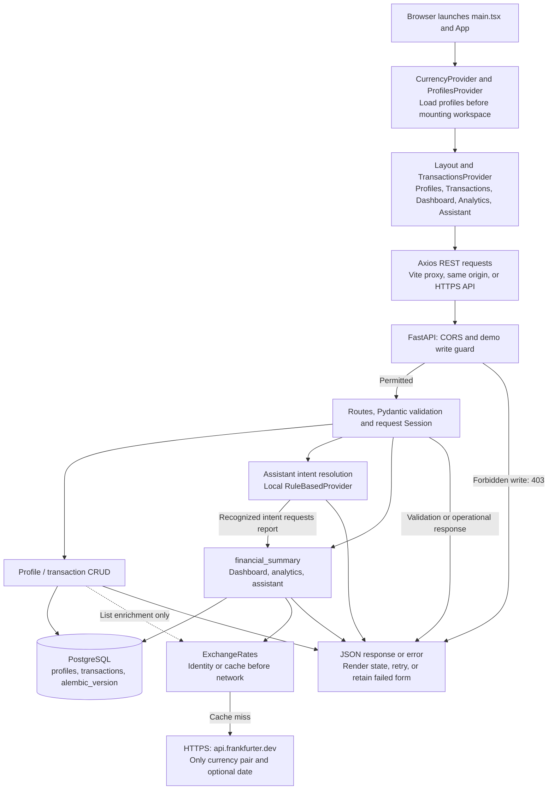
```mermaid
flowchart TB
  Browser["Browser launches main.tsx and App"]
  State["CurrencyProvider and ProfilesProvider<br/>Load profiles before mounting workspace"]
  Pages["Layout and TransactionsProvider<br/>Profiles, Transactions, Dashboard, Analytics, Assistant"]
  HTTP["Axios REST requests<br/>Vite proxy, same origin, or HTTPS API"]
  Guard["FastAPI: CORS and demo write guard"]
  Routes["Routes, Pydantic validation and request Session"]
  CRUD["Profile / transaction CRUD"]
  Assistant["Assistant intent resolution<br/>Local RuleBasedProvider"]
  Reports["financial_summary<br/>Dashboard, analytics, assistant"]
  DB[("PostgreSQL<br/>profiles, transactions, alembic_version")]
  FX["ExchangeRates<br/>Identity or cache before network"]
  External["HTTPS: api.frankfurter.dev<br/>Only currency pair and optional date"]
  Response["JSON response or error<br/>Render state, retry, or retain failed form"]
  Browser --> State --> Pages --> HTTP --> Guard
  Guard -->|Permitted| Routes
  Guard -->|Forbidden write: 403| Response
  Routes --> CRUD
  Routes --> Assistant
  Routes --> Reports
  CRUD --> DB
  Reports --> DB
  Assistant -->|Recognized intent requests report| Reports
  Reports --> FX
  CRUD -.->|List enrichment only| FX
  FX -->|Cache miss| External
  CRUD --> Response
  Reports --> Response
  Assistant --> Response
  Routes -->|Validation or operational response| Response
```

Return arrows are represented by response boxes rather than long edges back to
the top. `RuleBasedProvider` receives a summary only for assistant requests;
dashboard and analytics do not invoke the provider. Direct exchange-rate and
operational endpoints are expanded below.

### 1.1 Browser initialization, selection, and frontend state

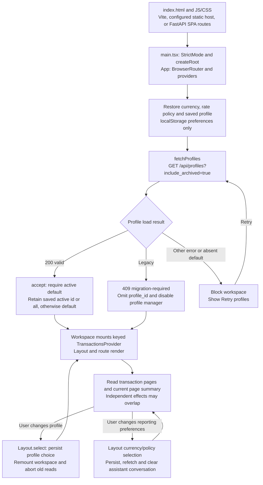
```mermaid
flowchart TB
  Start["index.html and JS/CSS<br/>Vite, configured static host, or FastAPI SPA routes"]
  App["main.tsx: StrictMode and createRoot<br/>App: BrowserRouter and providers"]
  Prefs["Restore currency, rate policy and saved profile<br/>localStorage preferences only"]
  Load["fetchProfiles<br/>GET /api/profiles?include_archived=true"]
  Result{"Profile load result"}
  Accept["accept: require active default<br/>Retain saved active id or all, otherwise default"]
  Legacy["409 migration-required<br/>Omit profile_id and disable profile manager"]
  Retry["Block workspace<br/>Show Retry profiles"]
  Mount["Workspace mounts keyed TransactionsProvider<br/>Layout and route render"]
  Effects["Read transaction pages and current page summary<br/>Independent effects may overlap"]
  Select["Layout.select: persist profile choice<br/>Remount workspace and abort old reads"]
  Currency["Layout currency/policy selection<br/>Persist, refetch and clear assistant conversation"]
  Start --> App --> Prefs --> Load --> Result
  Result -->|200 valid| Accept --> Mount
  Result -->|Legacy| Legacy --> Mount
  Result -->|Other error or absent default| Retry
  Retry -->|Retry| Load
  Mount --> Effects
  Effects -->|User changes profile| Select --> Mount
  Effects -->|User changes reporting preferences| Currency --> Effects
```

### 1.2 Shared HTTP request gate

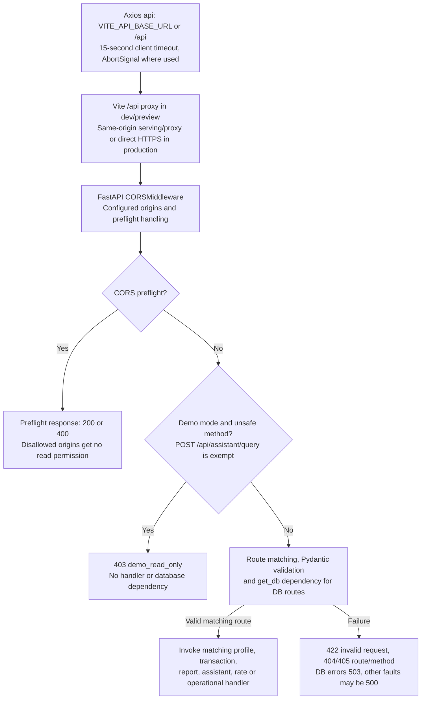
```mermaid
flowchart TB
  Client["Axios api: VITE_API_BASE_URL or /api<br/>15-second client timeout, AbortSignal where used"]
  Transport["Vite /api proxy in dev/preview<br/>Same-origin serving/proxy or direct HTTPS in production"]
  Cors["FastAPI CORSMiddleware<br/>Configured origins and preflight handling"]
  Preflight{"CORS preflight?"}
  CorsReply["Preflight response: 200 or 400<br/>Disallowed origins get no read permission"]
  Demo{"Demo mode and unsafe method?<br/>POST /api/assistant/query is exempt"}
  Block["403 demo_read_only<br/>No handler or database dependency"]
  Route["Route matching, Pydantic validation<br/>and get_db dependency for DB routes"]
  Dispatch["Invoke matching profile, transaction,<br/>report, assistant, rate or operational handler"]
  Error["422 invalid request, 404/405 route/method<br/>DB errors 503, other faults may be 500"]
  Client --> Transport --> Cors --> Preflight
  Preflight -->|Yes| CorsReply
  Preflight -->|No| Demo
  Demo -->|Yes| Block
  Demo -->|No| Route
  Route -->|Valid matching route| Dispatch
  Route -->|Failure| Error
```

CORS is not authorization: a nonpreflight request can execute even if the browser
cannot read its response. The independent demo guard controls writes.

### 1.3 Profile management

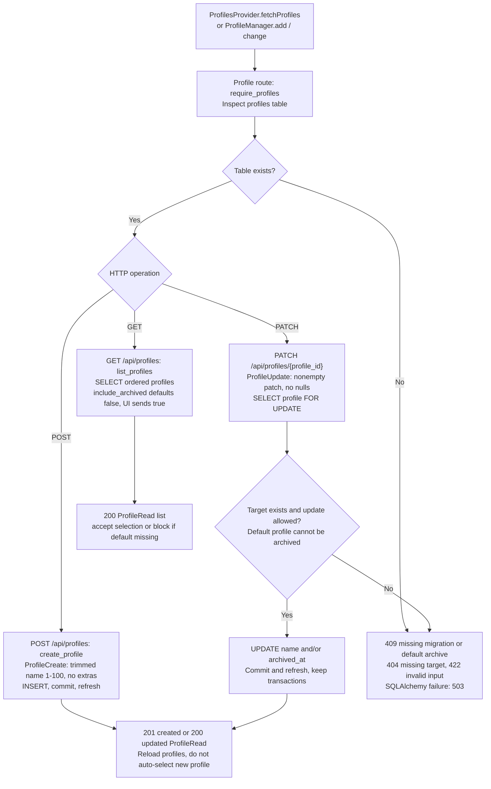
```mermaid
flowchart TB
  UI["ProfilesProvider.fetchProfiles<br/>or ProfileManager.add / change"]
  Require["Profile route: require_profiles<br/>Inspect profiles table"]
  Exists{"Table exists?"}
  Operation{"HTTP operation"}
  List["GET /api/profiles: list_profiles<br/>SELECT ordered profiles<br/>include_archived defaults false, UI sends true"]
  Create["POST /api/profiles: create_profile<br/>ProfileCreate: trimmed name 1-100, no extras<br/>INSERT, commit, refresh"]
  Update["PATCH /api/profiles/{profile_id}<br/>ProfileUpdate: nonempty patch, no nulls<br/>SELECT profile FOR UPDATE"]
  Allowed{"Target exists and update allowed?<br/>Default profile cannot be archived"}
  Save["UPDATE name and/or archived_at<br/>Commit and refresh, keep transactions"]
  ListReply["200 ProfileRead list<br/>accept selection or block if default missing"]
  WriteReply["201 created or 200 updated ProfileRead<br/>Reload profiles, do not auto-select new profile"]
  Error["409 missing migration or default archive<br/>404 missing target, 422 invalid input<br/>SQLAlchemy failure: 503"]
  UI --> Require --> Exists
  Exists -->|No| Error
  Exists -->|Yes| Operation
  Operation -->|GET| List --> ListReply
  Operation -->|POST| Create --> WriteReply
  Operation -->|PATCH| Update --> Allowed
  Allowed -->|Yes| Save --> WriteReply
  Allowed -->|No| Error
```

Input validation and the shared demo guard apply before these business
operations. `profiles` is the only business table written by this branch.

### 1.4 Transaction reads and list rendering

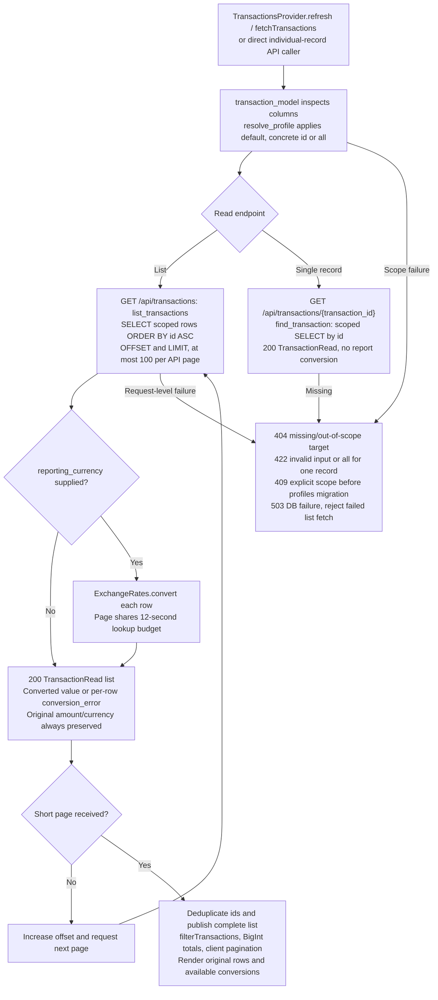
```mermaid
flowchart TB
  Read["TransactionsProvider.refresh / fetchTransactions<br/>or direct individual-record API caller"]
  Scope["transaction_model inspects columns<br/>resolve_profile applies default, concrete id or all"]
  Kind{"Read endpoint"}
  List["GET /api/transactions: list_transactions<br/>SELECT scoped rows ORDER BY id ASC<br/>OFFSET and LIMIT, at most 100 per API page"]
  Convert{"reporting_currency supplied?"}
  Enrich["ExchangeRates.convert each row<br/>Page shares 12-second lookup budget"]
  ListReply["200 TransactionRead list<br/>Converted value or per-row conversion_error<br/>Original amount/currency always preserved"]
  Pages{"Short page received?"}
  Next["Increase offset and request next page"]
  Render["Deduplicate ids and publish complete list<br/>filterTransactions, BigInt totals, client pagination<br/>Render original rows and available conversions"]
  One["GET /api/transactions/{transaction_id}<br/>find_transaction: scoped SELECT by id<br/>200 TransactionRead, no report conversion"]
  Failure["404 missing/out-of-scope target<br/>422 invalid input or all for one record<br/>409 explicit scope before profiles migration<br/>503 DB failure, reject failed list fetch"]
  Read --> Scope --> Kind
  Scope -->|Scope failure| Failure
  Kind -->|List| List --> Convert
  Kind -->|Single record| One
  One -->|Missing| Failure
  Convert -->|No| ListReply
  Convert -->|Yes| Enrich --> ListReply
  ListReply --> Pages
  Pages -->|No| Next --> List
  Pages -->|Yes| Render
  List -->|Request-level failure| Failure
```

The normal UI supplies reporting currency and fetches lists; the single-record
GET is implemented but is not used to open edit dialogs. Search and visible
pagination happen in the browser after API pagination finishes.

### 1.5 Transaction writes

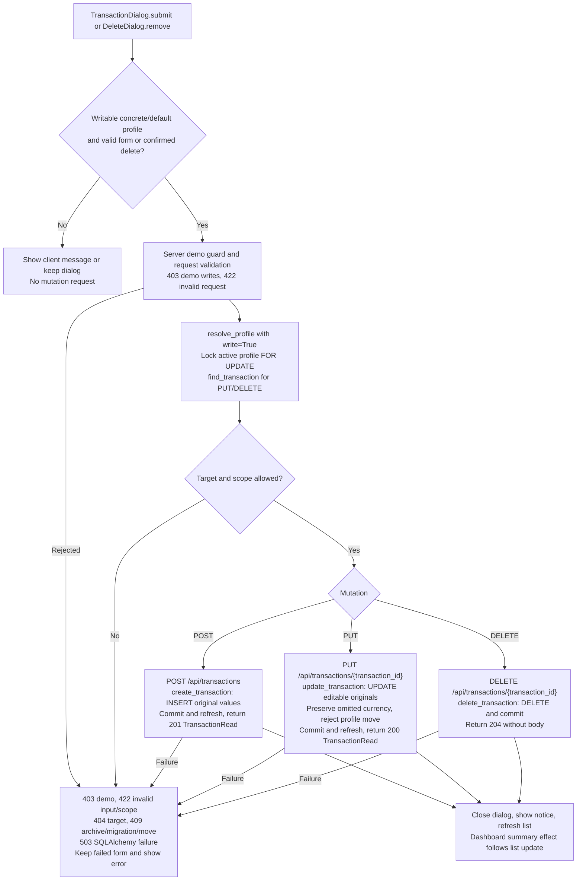
```mermaid
flowchart TB
  Form["TransactionDialog.submit or DeleteDialog.remove"]
  Client{"Writable concrete/default profile<br/>and valid form or confirmed delete?"}
  NoSend["Show client message or keep dialog<br/>No mutation request"]
  Guard["Server demo guard and request validation<br/>403 demo writes, 422 invalid request"]
  Scope["resolve_profile with write=True<br/>Lock active profile FOR UPDATE<br/>find_transaction for PUT/DELETE"]
  Allowed{"Target and scope allowed?"}
  Method{"Mutation"}
  Create["POST /api/transactions<br/>create_transaction: INSERT original values<br/>Commit and refresh, return 201 TransactionRead"]
  Update["PUT /api/transactions/{transaction_id}<br/>update_transaction: UPDATE editable originals<br/>Preserve omitted currency, reject profile move<br/>Commit and refresh, return 200 TransactionRead"]
  Delete["DELETE /api/transactions/{transaction_id}<br/>delete_transaction: DELETE and commit<br/>Return 204 without body"]
  Done["Close dialog, show notice, refresh list<br/>Dashboard summary effect follows list update"]
  Error["403 demo, 422 invalid input/scope<br/>404 target, 409 archive/migration/move<br/>503 SQLAlchemy failure<br/>Keep failed form and show error"]
  Form --> Client
  Client -->|No| NoSend
  Client -->|Yes| Guard --> Scope --> Allowed
  Guard -->|Rejected| Error
  Allowed -->|No| Error
  Allowed -->|Yes| Method
  Method -->|POST| Create --> Done
  Method -->|PUT| Update --> Done
  Method -->|DELETE| Delete --> Done
  Create -->|Failure| Error
  Update -->|Failure| Error
  Delete -->|Failure| Error
```

`TransactionWrite` validates the original amount/currency. The database write
never stores a reporting conversion. A response/refresh failure after COMMIT
cannot undo that commit and must not trigger an automatic mutation retry.

### 1.6 Dashboard, analytics, and shared report service

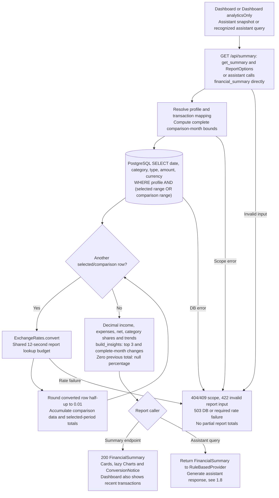
```mermaid
flowchart TB
  Caller["Dashboard or Dashboard analyticsOnly<br/>Assistant snapshot or recognized assistant query"]
  Options["GET /api/summary: get_summary and ReportOptions<br/>or assistant calls financial_summary directly"]
  Scope["Resolve profile and transaction mapping<br/>Compute complete comparison-month bounds"]
  Query[("PostgreSQL SELECT date, category, type, amount, currency<br/>WHERE profile AND (selected range OR comparison range)")]
  More{"Another selected/comparison row?"}
  Convert["ExchangeRates.convert<br/>Shared 12-second report lookup budget"]
  Accumulate["Round converted row half-up to 0.01<br/>Accumulate comparison data and selected-period totals"]
  Finish["Decimal income, expenses, net, category shares and trends<br/>build_insights: top 3 and complete-month changes<br/>Zero previous total: null percentage"]
  Context{"Report caller"}
  Report["200 FinancialSummary<br/>Cards, lazy Charts and ConversionNotice<br/>Dashboard also shows recent transactions"]
  Provider["Return FinancialSummary to RuleBasedProvider<br/>Generate assistant response, see 1.8"]
  Failure["404/409 scope, 422 invalid report input<br/>503 DB or required rate failure<br/>No partial report totals"]
  Caller --> Options --> Scope --> Query --> More
  More -->|Yes| Convert --> Accumulate --> More
  Convert -->|Rate failure| Failure
  More -->|No| Finish --> Context
  Context -->|Summary endpoint| Report
  Context -->|Assistant query| Provider
  Options -->|Invalid input| Failure
  Scope -->|Scope error| Failure
  Query -->|DB error| Failure
```

Analytics is the same component/service, with the recent-list section replaced
by an informational count. Only chart coordinates use Number; totals and exact
monetary formatting use decimal strings/BigInt.

### 1.7 Currency conversion and Frankfurter

Policy/cache and provider access are split so early-return paths do not span an
entire page. The provider lookup in 1.7b returns to the caller in 1.7a.

#### 1.7a Policy and cache

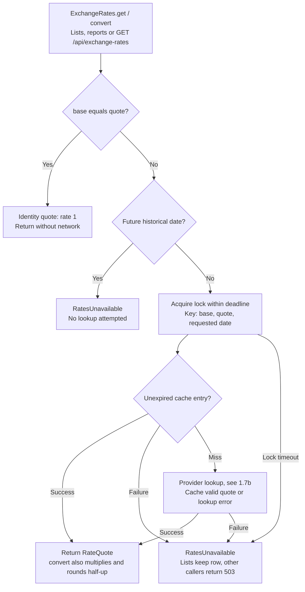
```mermaid
flowchart TB
  Call["ExchangeRates.get / convert<br/>Lists, reports or GET /api/exchange-rates"]
  Same{"base equals quote?"}
  Identity["Identity quote: rate 1<br/>Return without network"]
  Future{"Future historical date?"}
  Reject["RatesUnavailable<br/>No lookup attempted"]
  Lock["Acquire lock within deadline<br/>Key: base, quote, requested date"]
  Hit{"Unexpired cache entry?"}
  Quote["Return RateQuote<br/>convert also multiplies and rounds half-up"]
  Error["RatesUnavailable<br/>Lists keep row, other callers return 503"]
  Fetch["Provider lookup, see 1.7b<br/>Cache valid quote or lookup error"]
  Call --> Same
  Same -->|Yes| Identity
  Same -->|No| Future
  Future -->|Yes| Reject
  Future -->|No| Lock --> Hit
  Lock -->|Lock timeout| Error
  Hit -->|Success| Quote
  Hit -->|Failure| Error
  Hit -->|Miss| Fetch
  Fetch -->|Success| Quote
  Fetch -->|Failure| Error
```

#### 1.7b Provider lookup and historical fallback

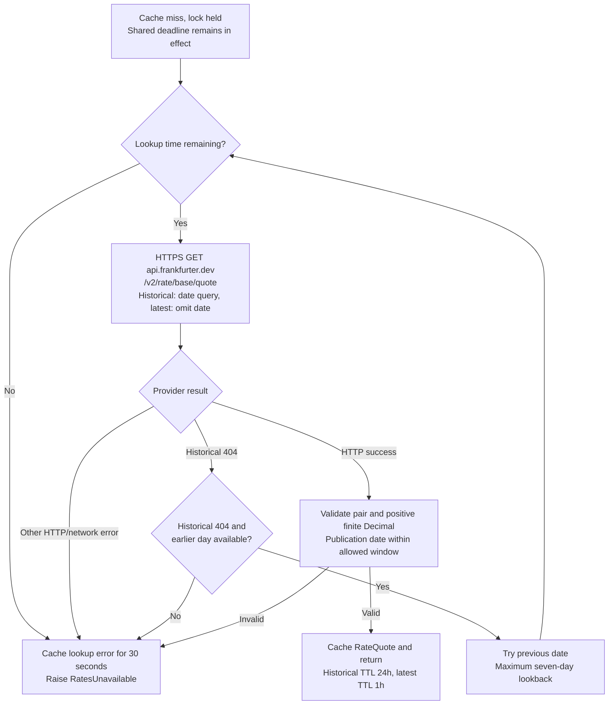
```mermaid
flowchart TB
  Begin["Cache miss, lock held<br/>Shared deadline remains in effect"]
  Budget{"Lookup time remaining?"}
  Request["HTTPS GET api.frankfurter.dev<br/>/v2/rate/base/quote<br/>Historical: date query, latest: omit date"]
  Status{"Provider result"}
  Back{"Historical 404 and<br/>earlier day available?"}
  Prior["Try previous date<br/>Maximum seven-day lookback"]
  Validate["Validate pair and positive finite Decimal<br/>Publication date within allowed window"]
  Success["Cache RateQuote and return<br/>Historical TTL 24h, latest TTL 1h"]
  Error["Cache lookup error for 30 seconds<br/>Raise RatesUnavailable"]
  Begin --> Budget
  Budget -->|No| Error
  Budget -->|Yes| Request --> Status
  Status -->|HTTP success| Validate
  Status -->|Historical 404| Back
  Status -->|Other HTTP/network error| Error
  Back -->|Yes| Prior --> Budget
  Back -->|No| Error
  Validate -->|Valid| Success
  Validate -->|Invalid| Error
```

The cache is process-local and capped at 2048 entries. Identity, future-date
rejection and lock-acquisition failure occur outside the cached lookup block.
Historical never silently becomes latest. Section 7 gives timeout and date rules.

### 1.8 AI Assistant

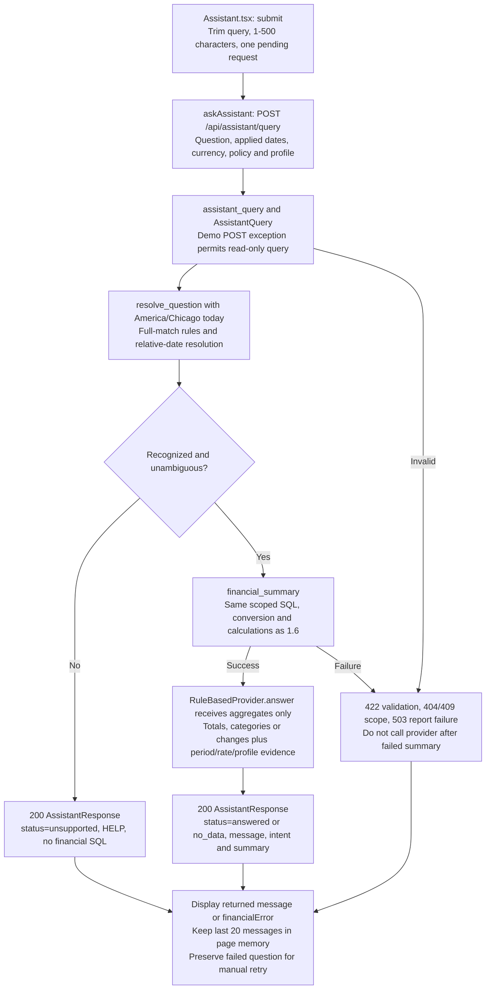
```mermaid
flowchart TB
  UI["Assistant.tsx: submit<br/>Trim query, 1-500 characters, one pending request"]
  Request["askAssistant: POST /api/assistant/query<br/>Question, applied dates, currency, policy and profile"]
  Validate["assistant_query and AssistantQuery<br/>Demo POST exception permits read-only query"]
  Resolve["resolve_question with America/Chicago today<br/>Full-match rules and relative-date resolution"]
  Intent{"Recognized and unambiguous?"}
  Unsupported["200 AssistantResponse<br/>status=unsupported, HELP, no financial SQL"]
  Summary["financial_summary<br/>Same scoped SQL, conversion and calculations as 1.6"]
  Provider["RuleBasedProvider.answer receives aggregates only<br/>Totals, categories or changes plus period/rate/profile evidence"]
  Reply["200 AssistantResponse<br/>status=answered or no_data, message, intent and summary"]
  Error["422 validation, 404/409 scope, 503 report failure<br/>Do not call provider after failed summary"]
  Display["Display returned message or financialError<br/>Keep last 20 messages in page memory<br/>Preserve failed question for manual retry"]
  UI --> Request --> Validate --> Resolve --> Intent
  Validate -->|Invalid| Error
  Intent -->|No| Unsupported --> Display
  Intent -->|Yes| Summary
  Summary -->|Success| Provider --> Reply --> Display
  Summary -->|Failure| Error --> Display
```

There is no external LLM or stored conversation. This-month queries stop at today;
relative qualifiers conflicting with explicit date controls return unsupported.

### 1.9 Operational probes and failures

#### Operational probes (not automatically called by the frontend)

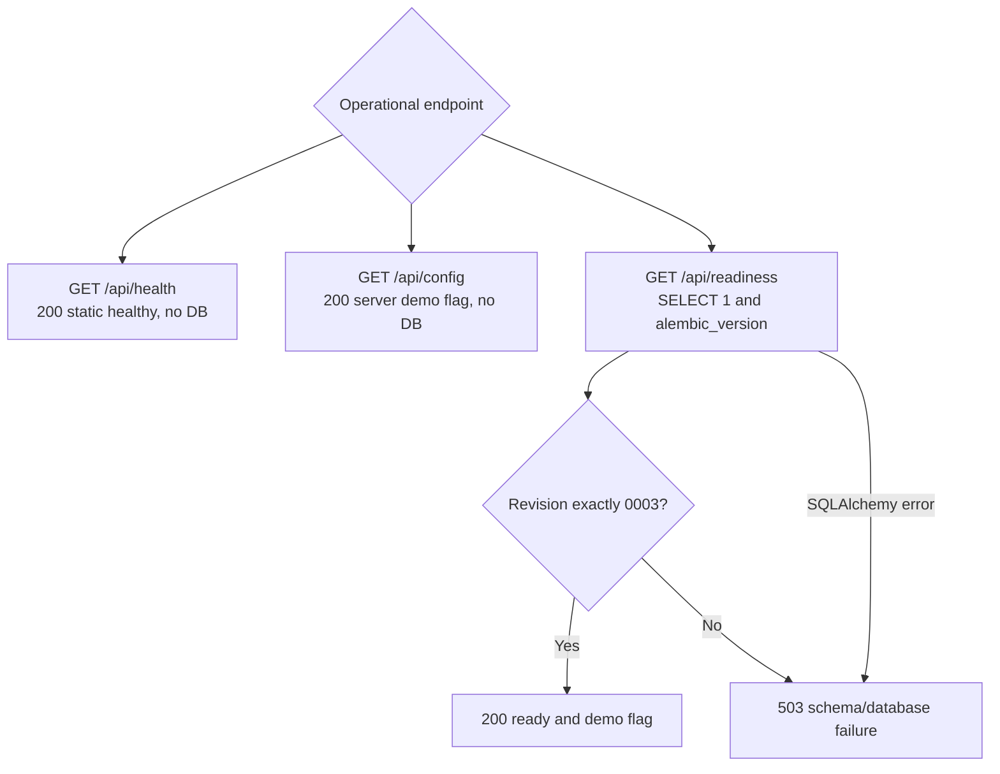
```mermaid
flowchart TB
  Probe{"Operational endpoint"}
  Health["GET /api/health<br/>200 static healthy, no DB"]
  Config["GET /api/config<br/>200 server demo flag, no DB"]
  Ready["GET /api/readiness<br/>SELECT 1 and alembic_version"]
  Revision{"Revision exactly 0003?"}
  Good["200 ready and demo flag"]
  Bad["503 schema/database failure"]
  Probe --> Health
  Probe --> Config
  Probe --> Ready --> Revision
  Ready -->|SQLAlchemy error| Bad
  Revision -->|Yes| Good
  Revision -->|No| Bad
```

#### Request failures

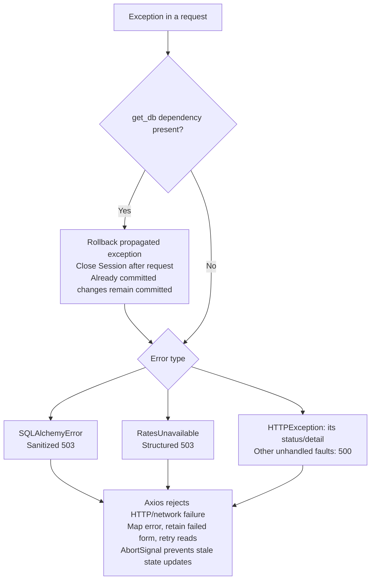
```mermaid
flowchart TB
  Exception["Exception in a request"]
  DB{"get_db dependency present?"}
  Session["Rollback propagated exception<br/>Close Session after request<br/>Already committed changes remain committed"]
  ErrorType{"Error type"}
  SQL["SQLAlchemyError<br/>Sanitized 503"]
  Rate["RatesUnavailable<br/>Structured 503"]
  Other["HTTPException: its status/detail<br/>Other unhandled faults: 500"]
  UI["Axios rejects HTTP/network failure<br/>Map error, retain failed form, retry reads<br/>AbortSignal prevents stale state updates"]
  Exception --> DB
  DB -->|Yes| Session --> ErrorType
  DB -->|No| ErrorType
  ErrorType --> SQL --> UI
  ErrorType --> Rate --> UI
  ErrorType --> Other --> UI
```

Per-row rate failures in transaction lists are caught by the handler and become
`conversion_error` fields; they do not propagate to this request-error path.

## 2. Detailed request-response sequences

The lifecycle is split by operation to keep labels readable. Each diagram uses
at most six participants. FastAPI may resolve dependencies before every validation
error is known; constructing a Session does not itself issue business SQL.
CORS and the demo write guard run before the route/dependency work. Browser
cancellation prevents stale UI updates but does not guarantee server cancellation.

### 2.1 Browser bootstrap and transaction-list requests

#### 2.1a Load the workspace

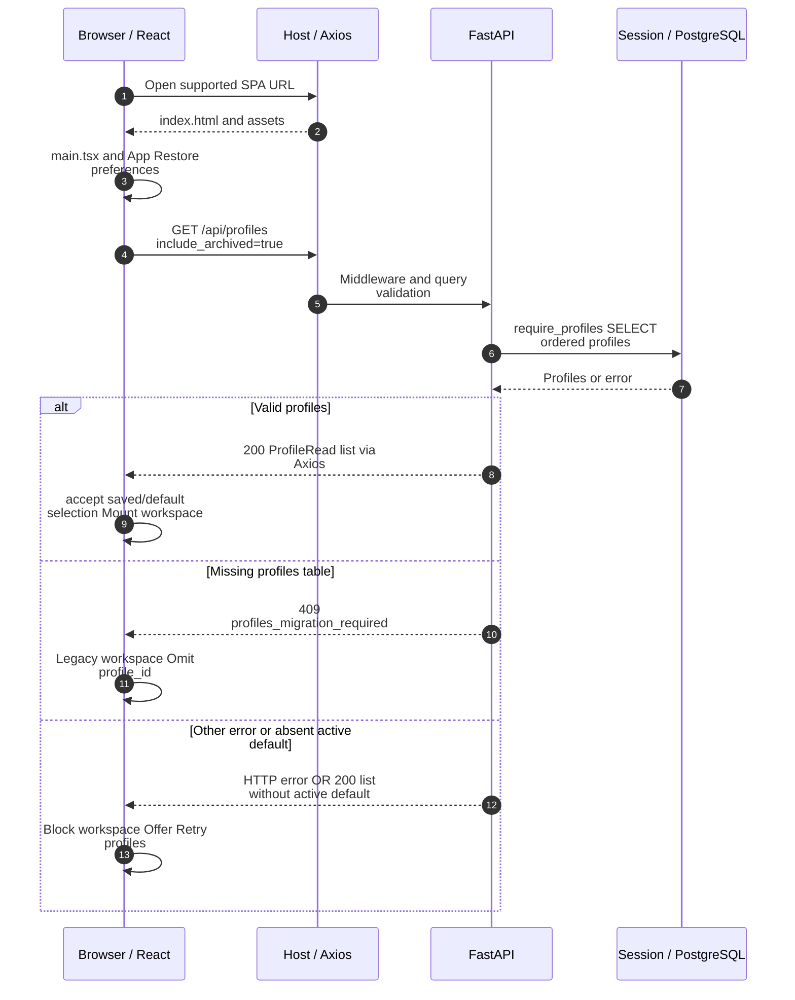
```mermaid
sequenceDiagram
  autonumber
  participant UI as Browser / React
  participant HTTP as Host / Axios
  participant API as FastAPI
  participant DB as Session / PostgreSQL
  UI->>HTTP: Open supported SPA URL
  HTTP-->>UI: index.html and assets
  UI->>UI: main.tsx and App Restore<br/>preferences
  UI->>HTTP: GET /api/profiles<br/>include_archived=true
  HTTP->>API: Middleware and query<br/>validation
  API->>DB: require_profiles SELECT<br/>ordered profiles
  DB-->>API: Profiles or error
  alt Valid profiles
    API-->>UI: 200 ProfileRead list via<br/>Axios
    UI->>UI: accept saved/default<br/>selection Mount workspace
  else Missing profiles table
    API-->>UI: 409<br/>profiles_migration_required
    UI->>UI: Legacy workspace Omit<br/>profile_id
  else Other error or absent active<br/>default
    API-->>UI: HTTP error OR 200 list<br/>without active default
    UI->>UI: Block workspace Offer Retry<br/>profiles
  end
```

#### 2.1b Fetch transaction pages after initialization

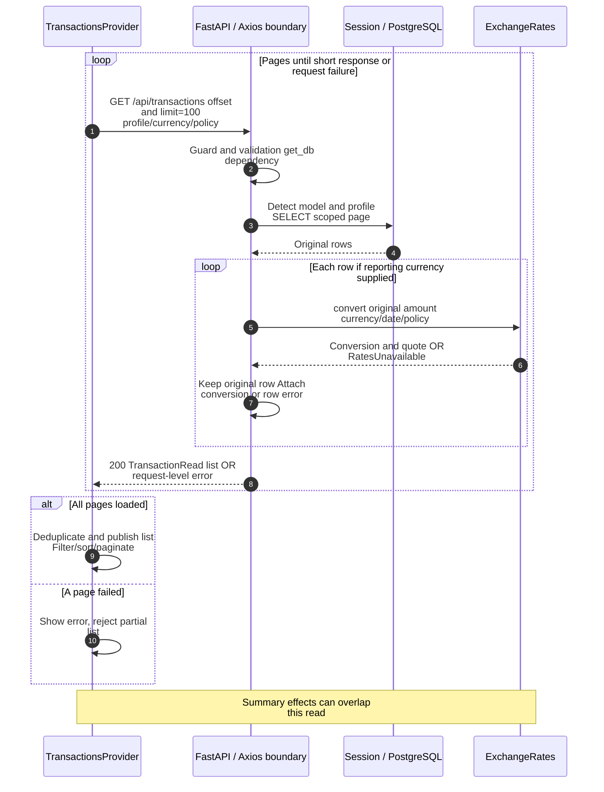
```mermaid
sequenceDiagram
  autonumber
  participant UI as TransactionsProvider
  participant API as FastAPI / Axios boundary
  participant DB as Session / PostgreSQL
  participant FX as ExchangeRates
  loop Pages until short response or<br/>request failure
    UI->>API: GET /api/transactions offset<br/>and limit=100<br/>profile/currency/policy
    API->>API: Guard and validation get_db<br/>dependency
    API->>DB: Detect model and profile<br/>SELECT scoped page
    DB-->>API: Original rows
    loop Each row if reporting currency<br/>supplied
      API->>FX: convert original amount<br/>currency/date/policy
      FX-->>API: Conversion and quote OR<br/>RatesUnavailable
      API->>API: Keep original row Attach<br/>conversion or row error
    end
    API-->>UI: 200 TransactionRead list OR<br/>request-level error
  end
  alt All pages loaded
    UI->>UI: Deduplicate and publish list<br/>Filter/sort/paginate
  else A page failed
    UI->>UI: Show error, reject partial<br/>list
  end
  Note over UI,FX: Summary effects can overlap<br/>this read
```

### 2.2 Reporting and historical-rate lookup

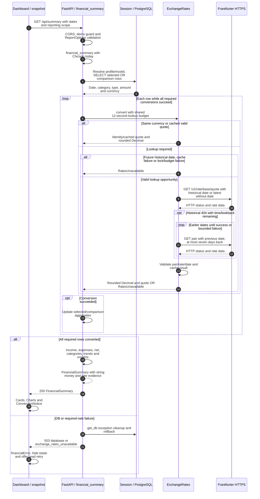
```mermaid
sequenceDiagram
  autonumber
  participant UI as Dashboard / snapshot
  participant API as FastAPI / financial_summary
  participant DB as Session / PostgreSQL
  participant FX as ExchangeRates
  participant Remote as Frankfurter HTTPS
  UI->>API: GET /api/summary with dates<br/>and reporting scope
  API->>API: CORS, demo guard and<br/>ReportOptions validation
  API->>API: financial_summary with<br/>Chicago today
  API->>DB: Resolve profile/model,<br/>SELECT selected OR<br/>comparison rows
  DB-->>API: Date, category, type, amount<br/>and currency
  loop Each row while all required<br/>conversions succeed
    API->>FX: convert with shared<br/>12-second lookup budget
    alt Same currency or cached valid<br/>quote
      FX-->>API: Identity/cached quote and<br/>rounded Decimal
    else Lookup required
      alt Future historical date, cache<br/>failure or lock/budget failure
        FX-->>API: RatesUnavailable
      else Valid lookup opportunity
        FX->>Remote: GET /v2/rate/base/quote with<br/>historical date or latest<br/>without date
        Remote-->>FX: HTTP status and rate data
        opt Historical 404 with time/lookback<br/>remaining
          loop Earlier dates until success or<br/>bounded failure
            FX->>Remote: GET pair with previous date,<br/>at most seven days back
            Remote-->>FX: HTTP status and rate data
          end
        end
        FX->>FX: Validate pair/rate/date and<br/>cache result
        FX-->>API: Rounded Decimal and quote OR<br/>RatesUnavailable
      end
    end
    opt Conversion succeeded
      API->>API: Update selected/comparison<br/>aggregates
    end
  end
  alt All required rows converted
    API->>API: Income, expenses, net,<br/>categories, trends and<br/>insights
    API-->>API: FinancialSummary with string<br/>money and rate evidence
    API-->>UI: 200 FinancialSummary
    UI->>UI: Cards, Charts and<br/>ConversionNotice
  else DB or required-rate failure
    API->>DB: get_db exception cleanup and<br/>rollback
    API-->>UI: 503 database or<br/>exchange_rates_unavailable
    UI->>UI: financialError, hide totals<br/>and offer read retry
  end
```

The rate path also serves transaction-list enrichment and the standalone rate
endpoint. The standalone endpoint has no Session. Scalar timeout overrides and
the cooperative deadline are described precisely in section 7. Earlier-date
fallback applies only to historical 404, never to arbitrary network/provider errors.

### 2.3 Profile and transaction mutations

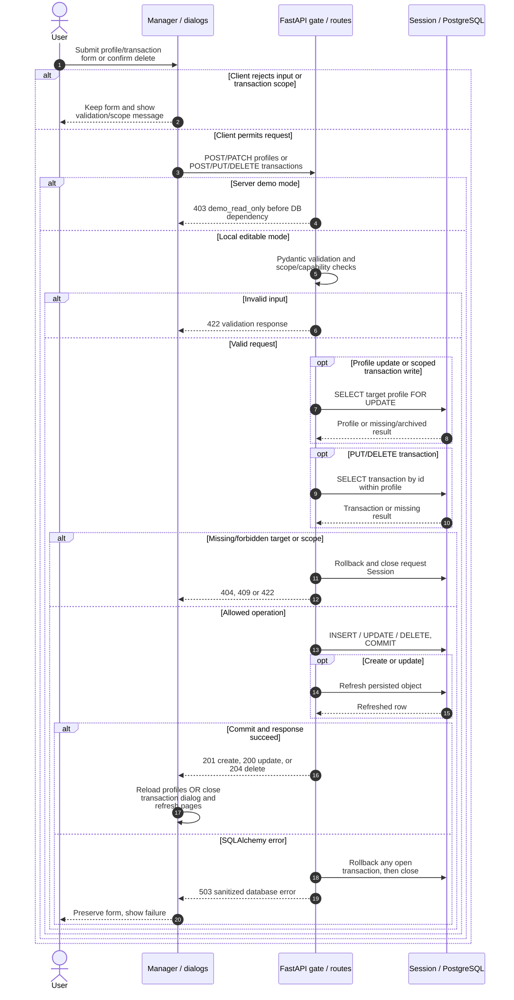
```mermaid
sequenceDiagram
  autonumber
  actor User
  participant UI as Manager / dialogs
  participant API as FastAPI gate / routes
  participant DB as Session / PostgreSQL
  User->>UI: Submit profile/transaction<br/>form or confirm delete
  alt Client rejects input or<br/>transaction scope
    UI-->>User: Keep form and show<br/>validation/scope message
  else Client permits request
    UI->>API: POST/PATCH profiles or<br/>POST/PUT/DELETE transactions
    alt Server demo mode
      API-->>UI: 403 demo_read_only before DB<br/>dependency
    else Local editable mode
      API->>API: Pydantic validation and<br/>scope/capability checks
      alt Invalid input
        API-->>UI: 422 validation response
      else Valid request
        opt Profile update or scoped<br/>transaction write
          API->>DB: SELECT target profile FOR<br/>UPDATE
          DB-->>API: Profile or missing/archived<br/>result
        end
        opt PUT/DELETE transaction
          API->>DB: SELECT transaction by id<br/>within profile
          DB-->>API: Transaction or missing<br/>result
        end
        alt Missing/forbidden target or scope
          API->>DB: Rollback and close request<br/>Session
          API-->>UI: 404, 409 or 422
        else Allowed operation
          API->>DB: INSERT / UPDATE / DELETE,<br/>COMMIT
          opt Create or update
            API->>DB: Refresh persisted object
            DB-->>API: Refreshed row
          end
          alt Commit and response succeed
            API-->>UI: 201 create, 200 update, or<br/>204 delete
            UI->>UI: Reload profiles OR close<br/>transaction dialog and<br/>refresh pages
          else SQLAlchemy error
            API->>DB: Rollback any open<br/>transaction, then close
            API-->>UI: 503 sanitized database error
            UI-->>User: Preserve form, show failure
          end
        end
      end
    end
  end
```

Creating a profile has no existing-profile lock. Profile lookup, schema
introspection and the data statement can add queries beyond those drawn.
Once COMMIT succeeds, a later refresh/response failure cannot undo the mutation.
The application has no idempotency-key or automatic reconciliation protocol.

### 2.4 Assistant query and terminal error paths

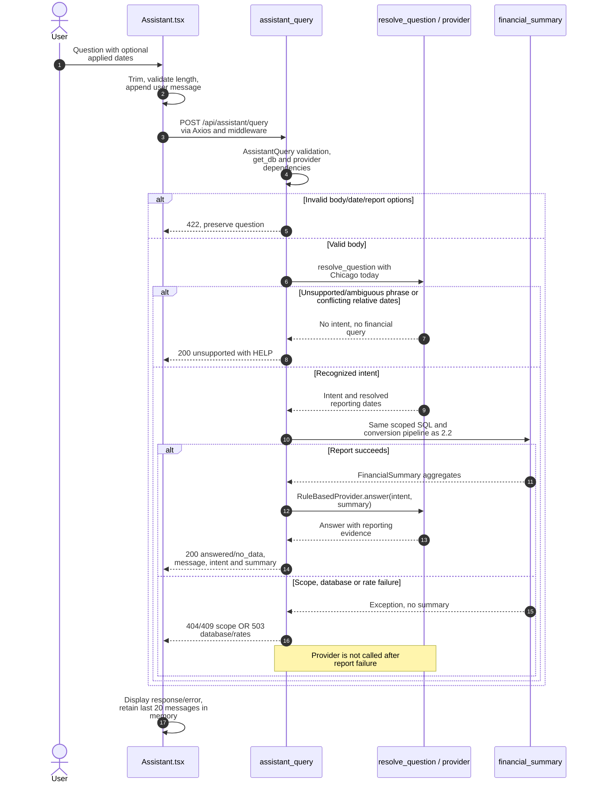
```mermaid
sequenceDiagram
  autonumber
  actor User
  participant UI as Assistant.tsx
  participant API as assistant_query
  participant Rules as resolve_question / provider
  participant Report as financial_summary
  User->>UI: Question with optional<br/>applied dates
  UI->>UI: Trim, validate length,<br/>append user message
  UI->>API: POST /api/assistant/query<br/>via Axios and middleware
  API->>API: AssistantQuery validation,<br/>get_db and provider<br/>dependencies
  alt Invalid body/date/report options
    API-->>UI: 422, preserve question
  else Valid body
    API->>Rules: resolve_question with<br/>Chicago today
    alt Unsupported/ambiguous phrase or<br/>conflicting relative dates
      Rules-->>API: No intent, no financial<br/>query
      API-->>UI: 200 unsupported with HELP
    else Recognized intent
      Rules-->>API: Intent and resolved<br/>reporting dates
      API->>Report: Same scoped SQL and<br/>conversion pipeline as 2.2
      alt Report succeeds
        Report-->>API: FinancialSummary aggregates
        API->>Rules: RuleBasedProvider.answer(intent,<br/>summary)
        Rules-->>API: Answer with reporting<br/>evidence
        API-->>UI: 200 answered/no_data,<br/>message, intent and summary
      else Scope, database or rate failure
        Report-->>API: Exception, no summary
        API-->>UI: 404/409 scope OR 503<br/>database/rates
        Note over API,Rules: Provider is not called after<br/>report failure
      end
    end
  end
  UI->>UI: Display response/error,<br/>retain last 20 messages in<br/>memory
```

Profile changes remount the workspace. Currency/policy changes clear assistant
history and abort prior requests. Applying different date bounds alone does not
clear existing messages. No previous messages or raw transaction rows are sent
with a query, and no external LLM is called.

## 3. Components, transport, and startup

### 3.1 Process startup is separate from browser startup

1. `backend/run_dev.py` changes to `backend`, enables source polling when unset,
   and launches Uvicorn on `127.0.0.1:8000` with reload watching `app/`.
2. `backend/run_prod.py` forces `APP_ENV=production`, binds `0.0.0.0`, uses `PORT`
   or 8000, and does not enable reload.
3. `app/main.py:create_app` loads runtime configuration. Production requires
   server demo mode and verified database TLS; demo mode requires the configured
   database name `finflow_demo`. Invalid runtime/production settings stop startup.
4. The app registers CORS, the demo guard, routers, and operational endpoints.
   With `FINFLOW_SERVE_FRONTEND=true`, it requires built frontend files and
   serves only the four explicit SPA entry paths plus `/assets`.
5. Nothing at normal startup creates tables, migrates, or seeds a database.
   `get_engine` lazily creates a cached engine; actual connection checkout happens
   when a request uses the database. Production validates settings at startup,
   but that is not a database-connectivity test.

### 3.2 Browser initialization and state ownership

`frontend/index.html` provides `#root` and loads `src/main.tsx` in development;
Vite emits the built asset references for production. `main.tsx` loads styles and
renders `App` under React `StrictMode`. Development StrictMode may run an effect
setup/cleanup cycle twice; the code uses cancellation rather than assuming only
one network request is observed.

`App` nests `BrowserRouter`, `CurrencyProvider`, and `ProfilesProvider` around
`Workspace`. Only preference values are stored in `localStorage`:

| Key | Owner | Behavior |
| --- | --- | --- |
| `finflow.currency` | `CurrencyProvider` | USD/INR/AED; invalid or absent value defaults to USD. |
| `finflow.ratePolicy` | `CurrencyProvider` | `latest` only when explicitly saved; otherwise historical. |
| `finflow.profile` | `ProfilesProvider` | Positive saved id or `all`; checked against loaded profiles. |

`ProfilesProvider` initially withholds its children while it loads profiles. Its
`accept` function requires an active default profile, retains `all` or a saved
active id, otherwise selects the default, and persists the resulting selection.
An archived saved id falls back on load/reload. Once rendered, the dropdown can
explicitly select an archived profile for reads, with editing disabled.

On `409 profiles_migration_required`, the provider renders the legacy workspace
with no explicit `profile_id`. Other load errors block all workspace children
and show a retry button. A missing default is also treated as a load failure.

`Workspace` keys `TransactionsProvider` by profile selection (or `legacy`). A
profile change remounts the route subtree, clears page-local dialogs/results/
assistant state, and cleans up in-flight requests. The shared provider reads
transactions even on the assistant route; the assistant also independently reads
its reporting snapshot.

### 3.3 Communication boundaries

| Link | Actual mechanism | Data crossing the boundary |
| --- | --- | --- |
| Browser to frontend host | HTTP locally; HTTPS at a configured public host | HTML, CSS, JS, and route navigation. |
| Frontend to API | Shared Axios `api`, `baseURL=(VITE_API_BASE_URL or /api)` with trailing slash removed; 15-second timeout | JSON bodies, path ids, reporting/profile/date query parameters; AbortSignal where implemented. |
| Vite to FastAPI | `/api` development and preview proxy, `changeOrigin=true`, target `API_PROXY_TARGET` or localhost:8000 | Same API path and payload; no database credentials in frontend configuration. |
| Built frontend to FastAPI | Same-origin asset/API serving, a configured host reverse proxy, or an absolute HTTPS API URL | The built SPA has no built-in Vite proxy. Cross-origin browser access requires configured CORS origins. |
| FastAPI to PostgreSQL | SQLAlchemy synchronous sessions and Psycopg driver | Parameterized SQL; request data stored only by explicit write routes. |
| Backend to Frankfurter | Synchronous HTTPX HTTPS client; `trust_env=False`, TLS verification enabled, redirects disabled | Currency pair in URL, optional date query. No transaction amounts, descriptions, profile names, queries, or DB credentials. |
| Frontend/backend to an LLM | **No implemented connection** | The assistant uses only local rules and computed summaries. |

`DB_*` configuration comes from `backend/.env` overlaid with process environment.
Database settings use `SecretStr`, hidden SQL parameters, `pool_pre_ping=True`,
and a five-second connection timeout. Production requires `sslmode=verify-full`
and defaults root trust to `system`; development preserves `prefer` unless set.
The application does not enforce database role grants itself: provisioning a
SELECT-only demo role is an external setup step documented in `DEPLOYMENT.md`.

## 4. Profile management and selection

Sources: `components/ProfileManager.tsx`, `hooks/ProfilesContext.tsx`,
`api/profiles.ts`, `app/profiles.py`, `app/profile_schemas.py`, and
`app/profile_scope.py`.

| Operation / frontend | Exact API | Backend, table, response |
| --- | --- | --- |
| Initial load or `reload` through `fetchProfiles` | `GET /api/profiles?include_archived=true` | `list_profiles` calls `require_profiles`; selects `profiles` ordered by default descending, id ascending; returns `200 ProfileRead[]`. API default `include_archived=false` filters archived rows. |
| `ProfileManager.add` through `createProfile(name)` | `POST /api/profiles` with `{name}` | `ProfileCreate`: trimmed nonblank 1–100-character name, extra fields forbidden. `create_profile` adds row, commits and refreshes; returns `201 ProfileRead`. New profiles are not default. |
| Rename via `change` and `updateProfile` | `PATCH /api/profiles/{profile_id}` with `{name}` | Positive path id. `ProfileUpdate` rejects empty patches and explicit nulls; trimmed name validated. `update_profile` locks selected `profiles` row with `FOR UPDATE`, updates, commits, refreshes; returns `200 ProfileRead`. |
| Archive / restore via `updateProfile` | `PATCH /api/profiles/{profile_id}` with `{archived:true/false}` | Same lock; timestamp is current UTC on archive, null on restore. Default-profile archive returns 409. Existing transactions are retained. |
| Select profile in `Layout` | **No mutation endpoint** | `select` persists id/`all` and remounts workspace. Subsequent requests carry scope. |

`ProfileRead` returns `id`, `name`, `created_at`, `is_default`, and `archived_at`.
A successful manager action calls `reload`; creating a profile does not select it
automatically. A rename refreshes metadata but does not itself force a transaction
reload if the selected key remains unchanged. Manager errors use a generic
message; they do not display raw transport/database diagnostics.

Every profile endpoint requires the `profiles` table (409 if absent). Missing
update targets return 404. No profile deletion route, uniqueness rule for profile
names, account creation, or user ownership model exists.

Scope resolution for transactions/reports is shared:

- Omitted `profile_id` selects the default when profiles exist.
- Concrete ids select one profile; missing ids return 404.
- `all` reads all transactions, including archived profiles, without a profile
  equality predicate. It is rejected for individual-transaction access and writes.
- Transaction writes lock their active profile row, serializing against profile
  archive/restore. Archived reads are allowed; archived writes return 409.
- `ProfileScope` is implemented as `int | Literal['all'] | None`, without a
  positive-number constraint on all read-query parameters. A parsed zero/negative
  id reaches lookup and normally returns 404. Body `profile_id` and path ids have
  their own explicit positive constraints.

## 5. Transaction CRUD and local list processing

Sources: `pages/Transactions.tsx`, `components/TransactionDialog.tsx`,
`components/TransactionTable.tsx`, `api/transactions.ts`, `utils/finance.ts`,
`app/transactions.py`, `app/schemas.py`, and `app/transaction_storage.py`.

### 5.1 Reading lists and individual records

`TransactionsProvider.refresh` aborts its prior request, sets loading/error state,
and calls `fetchTransactions` with the selected profile, reporting currency, and
policy. The client requests pages of 100 (`offset=0,100,...`), stopping on a short
page, and deduplicates by id. It rejects malformed nonarray responses or any
failed page instead of exposing an incomplete new list.

`GET /api/transactions` maps to `list_transactions`. Its API defaults are
`offset=0`, `limit=50` (allowed 1–100), `reporting_currency=None`, and historical
policy. It performs a profile-scoped, id-ascending SELECT with OFFSET/LIMIT.
The normal frontend supplies a reporting currency, so each row is enriched with
converted values/evidence or an individual conversion failure. Without that
parameter, the route returns original rows without exchange-rate requests.

`GET /api/transactions/{transaction_id}` maps to `get_transaction` and
`find_transaction`. It enforces a positive path id, rejects scope `all` (422),
and selects the record within the requested/default profile. Missing or
out-of-scope records both return 404. **The current edit UI does not call this
endpoint**: it opens the record already loaded in the list.

`TransactionRead` includes original editable fields plus `id`, `created_at`,
`profile_id`, and optional `profile_name`, `reporting_currency`,
`converted_amount`, `conversion`, and `conversion_error`. Monetary Decimal
values serialize as strings. `profile_name` may require an additional ORM
profile lookup; there is no explicit joined list query.

After fetch, `filterTransactions` performs case-insensitive description/category
substring search, exact category/type filtering, inclusive date-string filtering,
and sorting by date descending then id descending. The UI slices the filtered
array into pages of 10/25/50. These are not server-side search/page-count APIs.
Fetching multiple API pages is not a cross-request database snapshot.

The filtered net total uses `totals` with BigInt cents: it uses the matching
converted value, or an original only if its currency matches the report currency.
A missing required conversion makes this total unavailable; mixed originals are
never added together. Original rows remain visible.

### 5.2 Write request contracts

| Frontend function | Exact endpoint | Backend operation and response |
| --- | --- | --- |
| `TransactionDialog.submit` → `createTransaction(input)` | `POST /api/transactions` | `create_transaction`: resolve/lock active profile, add `Transaction`, commit, refresh; `201 TransactionRead`. |
| `TransactionDialog.submit` → `updateTransaction(id,input)` | `PUT /api/transactions/{transaction_id}?profile_id={id}` when supplied | `update_transaction`: `find_transaction(write=True)`, forbid profile movement, update editable fields, commit, refresh; `200 TransactionRead`. |
| Confirmed `DeleteDialog.remove` → `deleteTransaction(id,profileId)` | `DELETE /api/transactions/{transaction_id}?profile_id={id}` when supplied | `delete_transaction`: scoped lookup, delete, commit; `204` with no body. |

The dialog checks `writable`, validates locally, trims description/category, and
includes a concrete selected profile in the body. Client validation checks
description length 1–500, category length 1–100, a positive decimal-string amount
with at most 12 integer digits and two fraction digits, supported currency/type,
and a real calendar date.

The server independently validates `TransactionWrite`: no extra fields; trimmed
bounded strings; finite positive Decimal amount with `max_digits=14` and
`decimal_places=2`; income/expense type; parsed date; USD/INR/AED currency
(default USD); optional positive body profile id. PUT requires the editable
fields rather than implementing PATCH semantics. If PUT omits currency, the
handler preserves the stored currency despite the model's USD default. Moving
the row to a different body profile returns 409. Original amounts/currency are
what is stored; report equivalents are never written back.

Successful UI mutations close the dialog, set a success notice, and refresh the
transaction list; the dashboard summary effect reacts to the updated list.
Failed mutations keep forms and entered values. A failed post-success reload
does not automatically repeat the mutation. Delete requires confirmation.
There is no undo/soft-delete for transaction deletion.

### 5.3 Schema capability detection

`transaction_model` inspects `transactions` columns and caches the model choice
in `Session.info`, not globally:

| Actual columns | ORM mapping | Behavior |
| --- | --- | --- |
| Includes `profile_id` | `Transaction` | Full profile and currency behavior associated with revision 0003. |
| `currency`, no `profile_id` | `CurrencyTransaction` | Unscoped currency-aware compatibility associated with 0002. |
| Neither new column | `LegacyTransaction` | USD-only compatibility associated with 0001. Non-USD writes return 409. |

If profiles are unavailable, an omitted scope retains legacy operations;
an explicit scope returns 409 and never silently expands to all data. Capability
detection uses actual tables/columns, not `alembic_version`. Some source comments
still mention older production phases; the current conditional logic above is
what executes. Readiness separately checks the revision table.

## 6. Dashboard, analytics, and calculations

`/` renders `Dashboard`; `/analytics` renders the same component with
`analyticsOnly=true`. Analytics is implemented, but has no separate REST route or
separate aggregation service. Both call `fetchSummary` → `GET /api/summary`.

1. The page derives available months and its recent rows/count labels from the
   shared transaction list. A selected month generates first/last calendar-day
   bounds; All time omits both. Full-month selection may include future-dated
   rows within that month. Date selection is page-local, not a global dashboard/
   assistant filter.
2. `reportingOptions` omits USD/historical defaults from summary/query parameters;
   `profileOptions` adds scope unless in legacy mode. An AbortController guards
   the report effect. Dependency changes clear the previous report and show loading.
3. `get_summary` validates `ReportOptions`: optional parsed ISO dates, ordered
   date range, known currency/policy, no unknown query fields, and profile scope.
4. `financial_summary` resolves scope/model and computes comparison month bounds.
   It selects only date, category, type, amount, and currency—not descriptions,
   ids, or creation timestamps—for the selected range **or** comparison months.
   Profile filtering applies before conversion/aggregation. One financial-row
   SELECT covers both selected and comparison data; profile/introspection queries
   are additional.
5. Every fetched row is converted before either aggregate is updated, including
   comparison rows outside the selected range. Thus a missing comparison-month
   rate can fail an otherwise narrow selected-range report.
6. With Decimal precision 50, converted amounts are individually rounded half-up
   to two decimals. Selected income and expenses are sums of those rounded rows;
   `net_balance = income - expenses`. Category totals use expenses only.
7. Categories sort by total descending then name; shares are
   `category_total / expenses * 100`, rounded half-up, or zero when expenses
   are zero. Rounded shares need not add to exactly 100.
8. Monthly trends sort ascending, with counts and income/expenses/net per month.
   Only recorded months appear; no empty months are fabricated in chart series.
9. `build_insights` keeps the top three spending categories and compares complete
   calendar months. `comparison_months` anchors at the earlier of end date/today,
   excludes a current or partial month, and includes the preceding full month.
   It is independent of `start_date`. Missing comparison months have zero totals
   and zero recorded counts. A zero previous total gives a null percentage change,
   not division by zero. Earliest representable dates can yield no comparison.
10. `partial_months` reports noncalendar boundaries or current/unbounded ranges.
    `FinancialSummary` returns period/as-of/profile metadata, currency/policy,
    conversion explanation/evidence, decimal-string totals, counts, categories,
    trends, and insights.
11. The dashboard renders cards, `ConversionNotice`, lazy `Charts`, and five recent
    transactions. Analytics renders the same cards/charts and an informational
    count instead of the recent-list section. The response's month-over-month
    insights are available to the assistant but are not rendered as a dedicated
    dashboard comparison widget.

`Charts` converts decimal strings to Number for Recharts coordinates only. It
retains exact strings for tooltip/data-table formatting. `money`/`decimalMoney`
use integer cents and currency locales. Extremely large chart coordinates can
lose floating-point precision even while displayed monetary strings remain exact.
The older exported `utils/finance.ts:analytics` helper is not called by production
pages; it is not the active dashboard aggregation path.

## 7. Currency conversion and external failures

`ExchangeRates` is shared per Python process through `get_exchange_rates`'s
`lru_cache`. Its own OrderedDict holds up to 2048 entries, keyed by base, quote,
and requested date. It is not stored in PostgreSQL, shared across workers, or
persistent across restarts.

1. `convert(amount,base,quote,day,policy,deadline)` passes `day` for historical
   policy, or no requested date for explicit latest valuation.
2. Equal currencies return identity rate 1 without acquiring the lock or making
   network requests. This check precedes the future-date check, so equal-currency
   future-dated rows do not require an unavailable historical rate.
3. A nonidentity future historical date raises `RatesUnavailable`. There is no
   automatic switch to latest valuation.
4. Nonidentity lookup acquires one thread lock within the remaining budget.
   Success-cache TTLs are 24 hours for historical and one hour for latest.
   A cached error is rethrown; a cached success sets `cache_hit=true`.
5. On a miss, HTTPX requests
   `GET https://api.frankfurter.dev/v2/rate/{base.lower()}/{quote.lower()}`.
   Historical adds `?date=YYYY-MM-DD`; latest omits `date`.
6. Historical 404 alone causes the loop to try earlier dates, through a maximum
   seven-day lookback. Other HTTP/network errors stop immediately. Each request
   receives a timeout bounded by five seconds and the remaining budget. The
   client is constructed with a five-second timeout and two-second connect value,
   but each lookup supplies its own scalar timeout override. The 12-second
   deadline is a cooperative lookup budget, not a hard whole-HTTP-request timeout.
7. The response must have the requested pair, a finite positive Decimal rate,
   and an actual publication date no later than the reference date and no more
   than seven days earlier. Historical reference is requested date; latest
   freshness uses the current UTC date.
8. HTTP errors, malformed JSON/data, invalid dates/rates, exhausted lookback, and
   budget errors raise `RatesUnavailable`. Failures caught within the lookup's
   lock/cache block are cached for 30 seconds. Identity, future-date rejection,
   and failure to acquire the lock occur outside that block.
9. Converted amounts use `amount * rate` with precision 50, quantized to `0.01`
   with `ROUND_HALF_UP`. `RateQuote` carries base/quote/rate, requested/published
   dates, UTC fetched timestamp, cache-hit flag, and source.

There are three API consumers:

| Caller | Rate failure behavior |
| --- | --- |
| `list_transactions` | Catches per row; retains original row and returns 200 with missing `converted_amount` and `conversion_error`. |
| `financial_summary`, including assistant reports | Propagates; global handler returns 503 with structured `exchange_rates_unavailable` detail; no partial report totals. |
| Standalone `GET /api/exchange-rates?base=USD&quote=AED&rate_date=YYYY-MM-DD` | `exchange_rate` returns 200 `RateQuote`, or the same 503. Omitting `rate_date` explicitly requests latest. No DB dependency. |

The current frontend does not call the standalone endpoint; list/report routes
call the same service internally. `financialError` recognizes the rate error
code and hides report totals rather than relabeling stale totals. Raw originals
can remain visible in transaction tables. `ConversionNotice` shows publication
dates and identifies a prior-date fallback.

## 8. AI Assistant request and answer flow

Sources: `pages/Assistant.tsx`, `api/financial.ts`, `app/financial_routes.py`,
`app/financial_schemas.py`, and `app/assistant_service.py`.

The page independently loads a snapshot with `GET /api/summary` and applied
optional dates. Applying dates validates range order in the browser; All time
clears bounds. The snapshot has its own retry counter. Asking a question does
not reuse the snapshot as the authoritative backend input.

`submit` trims the question, checks 1–500 characters and the pending flag,
appends the user message, and calls `askAssistant`:

```text
POST /api/assistant/query
JSON: query, optional start_date/end_date, reporting_currency, rate_policy, profile_id
```

No cached transaction rows or prior chat messages are sent. The backend's
`AssistantQuery` inherits reporting/date validation and forbids extra fields.
`assistant_query` obtains Chicago's current date and a `RuleBasedProvider`, then:

1. `resolve_question` case-folds, normalizes whitespace/punctuation, rejects
   digits and unsupported action/forecast/date words, and full-matches supported
   sentence patterns. Supported intents are `summary`, `income`, `expenses`,
   `balance`, `top_categories`, `income_change`, and `expense_change`.
2. At most one of this month, last month, or all time is allowed. Relative phrases
   mixed with explicit date controls return unsupported. This month resolves to
   month start through today; last month resolves to the previous complete month.
   Change intents permit last month but reject this month/all-time qualifiers.
3. Unsupported requests return **200**, not a validation error: `provider` is
   `rule_based`, `status` is `unsupported`, `intent`/`summary` are null, and
   `message` contains HELP. A DB Session dependency is constructed, but the
   unsupported branch issues no financial SQL or exchange-rate calls.
4. Recognized requests call the same `financial_summary` pipeline, with resolved
   dates and supplied reporting/profile scope. Errors propagate; no answer is
   invented when PostgreSQL or a necessary rate is unavailable.
5. `RuleBasedProvider.answer(intent,summary)` receives aggregates only, never a
   Session or individual transaction records. It formats totals, top categories,
   or complete-month differences. It explains zero/missing data, appends reporting
   period, currency/policy, rate-date evidence, and profile name.
6. A successful API response is `200 AssistantResponse` with `provider`,
   `status=answered|no_data`, `intent`, `message`, and the computed summary.
   Status selection depends on intent/data; comparison answers can be based on
   comparison-month rows even when selected-period count is zero.
7. The frontend displays `answer.message`, not an independently generated
   interpretation. It clears the input after success, preserves the question
   after transport failure, and prevents duplicate submissions while pending.

Conversation state is the last 20 **messages**, not 20 exchanges, in component
memory. It clears on explicit Clear conversation, unmount/reload/profile remount,
and currency/policy changes. Applying new date bounds does **not** clear existing
messages in the current code. Query requests are aborted on unmount or reporting
preference changes; snapshot requests are also canceled when their dependencies
change. Dashboard full-month bounds and an assistant this-month query can differ
because the latter stops at today.

## 9. PostgreSQL tables and schema setup

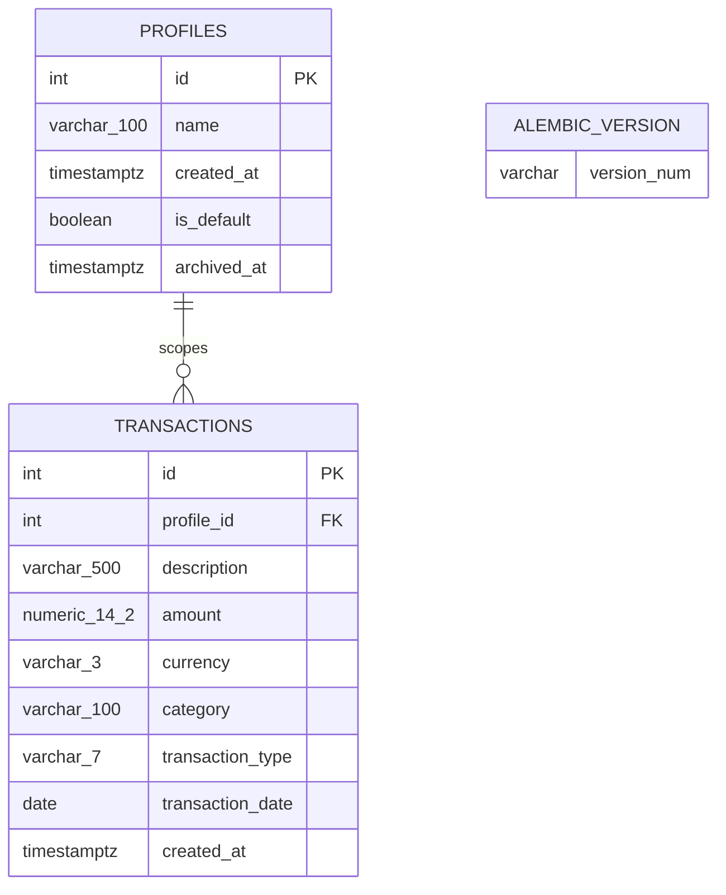
```mermaid
erDiagram
  PROFILES ||--o{ TRANSACTIONS : scopes
  PROFILES {
    int id PK
    varchar_100 name
    timestamptz created_at
    boolean is_default
    timestamptz archived_at
  }
  TRANSACTIONS {
    int id PK
    int profile_id FK
    varchar_500 description
    numeric_14_2 amount
    varchar_3 currency
    varchar_100 category
    varchar_7 transaction_type
    date transaction_date
    timestamptz created_at
  }
  ALEMBIC_VERSION {
    varchar version_num
  }
```

`alembic_version` is schema metadata, with no application foreign-key relationship.
`profiles` has a nonblank-name constraint, a default-cannot-be-archived check,
and a partial unique index allowing at most one default. That index does not
guarantee a default exists; migration/setup establishes it. Transactions have
positive-amount, income/expense, and USD/INR/AED checks. The restricted profile
foreign key preserves relationships. Composite indexes cover profile/id and
profile/transaction-date access.

Existing migration files establish the schema in order:

- `0001`: creates `transactions` and original constraints.
- `0002`: adds currency defaulting existing originals to USD and its check;
  downgrade refuses if non-USD metadata would be lost.
- `0003`: creates profiles/default profile, assigns existing transactions to it,
  makes the FK non-null, and adds indexes; downgrade refuses loss of profiles.

The default profile is created by migration, not `POST /api/profiles` or a page
read. Archived state is stored in `profiles`; there are no separate category,
currency, exchange-rate, summary, user, authentication, or chat tables.

`prepare_demo.py` is an explicit setup path outside the browser/request lifecycle.
It requires `DEMO_DATABASE_URL`, confirmation `finflow_demo`, verified TLS, an
actual database with that name, and no existing public tables. Within one
transaction it applies migrations through 0003, inserts 17 fictional transactions
across three profiles from `demo_data.json`, and archives one fixture profile.
It refuses reruns instead of resetting existing records. Normal app startup never
invokes it. It was not executed to generate this documentation.

## 10. Error handling and operational endpoints

| Situation | Actual backend behavior | Actual frontend behavior |
| --- | --- | --- |
| Demo-mode mutation | Middleware returns 403 `detail.code=demo_read_only` before routing/DB work. | Demo build hides ProfileManager and sets `writable=false`; direct calls remain server-blocked. Transaction `errorMessage` recognizes this code. |
| Invalid input | FastAPI/Pydantic 422 for constrained bodies, paths, queries and report ranges. | Transaction form renders mapped field errors; financial UI shows date/question guidance; profile manager shows a generic save failure. |
| Missing profile/transaction | HTTPException 404. Scoped transaction lookup conceals rows in other profiles by returning the same 404. | Transaction UI explains the missing row; financial/profile UI use their own generic error mapping. |
| Archived write/default archive/profile movement/missing migration | HTTPException 409 with string or structured detail. | Transaction UI handles conflict text; initial profile load specially recognizes migration-required; other financial/profile errors are less specific. |
| `all` in single-record operation or forbidden write scope | 422 where that scope is accepted by the parameter type; invalid body types can fail Pydantic earlier. | Usually prevented by `writable`; raw API callers still receive server errors. |
| SQLAlchemyError | `get_db` rolls back on propagated exception; global handler sends sanitized 503 `Database operation unavailable`. | No raw SQL/driver diagnostic is rendered. |
| Missing rate/blocked HTTPS/invalid provider/deadline | Structured 503 for summary/assistant/standalone; per-row enrichment error for lists. | Financial report totals hidden; row originals retained where available; retry offered. |
| CORS disallowed browser origin | No allow-origin approval; invalid preflight can return 400. Nonpreflight requests can still execute; CORS is not authorization. | Browser blocks access to response; Axios can surface a network-style failure. Demo guard is independent. |
| Canceled/stale request | Client cancellation does not guarantee the backend has stopped running. | AbortSignal prevents stale completion from updating state. |
| Network/15-second Axios timeout/failed later page | Client Promise rejects; no new partial list is published. | Retry/read error; failed forms/questions remain available. |
| Other runtime/configuration/serialization error | No universal custom handler; can return 500. Production invalid configuration is rejected at startup; development engine/config validation can occur lazily. | Falls through the relevant generic error mapping. |

Operational endpoints in `app/main.py`:

| Endpoint | Implementation / response | Automatic frontend caller? |
| --- | --- | --- |
| `GET /api/health` | Static `200 {status:healthy, service:FinFlow AI Backend}`; no DB query. | No. |
| `GET /api/readiness` | DB `SELECT 1` and `SELECT version_num FROM alembic_version`; requires exactly `['0003']`; returns 200 ready/demo flag or 503. It does not check rates or role grants. | No. |
| `GET /api/config` | Returns `{demo_mode:boolean}` only. | No. The UI uses build-time `VITE_DEMO_MODE`, not this endpoint. |
| `GET /` | Welcome JSON when frontend serving is off; built index when on. | Browser entry only in the latter configuration. |
| `GET /transactions`, `/analytics`, `/assistant` | Built index when frontend serving is enabled. | Browser navigation/deep link. |
| `GET /assets/...` | Static built assets when enabled; missing assets remain 404. | Browser asset loader. |
| `GET /docs`, `/redoc`, `/openapi.json` | FastAPI's generated API documentation/schema endpoints. | No application-page caller. |

The topbar's Data synced/Connection issue indicator comes from transaction
loading/error state, not a health poll. Frontend and server demo flags are
independent and must be configured together for matching presentation; changing
the browser flag cannot enable writes on a demo backend.

## 11. Implemented limits and unimplemented features

- No user registration/login, authentication, account authorization, or tenant
  isolation. Financial profiles are scopes inside one trusted workspace.
- No public writable mode in the production launcher: production requires demo
  mode. Local writes retain full features and must remain private.
- No external AI/LLM, embeddings, model training, predictions, arbitrary SQL,
  autonomous tools, or assistant mutation capabilities. `AssistantProvider` is
  an extension interface with only `RuleBasedProvider` implemented.
- No profile deletion endpoint, profile transfer of transactions, or undo for
  transaction deletion. Archive/restore is implemented for nondefault profiles.
- No server-side transaction text/category/date filtering or total-count API;
  search and visible list pagination run after client-side full pagination.
- No stored reports, persistent exchange-rate cache, chat database, background
  aggregation job, scheduled importer, bank connection, budget engine, or export
  workflow.
- No automatic DB setup on startup, automatic latest-for-historical substitution,
  distributed rate limiter, idempotency keys, or optimistic-concurrency/version
  check for editing transaction rows. Profile locks coordinate archives/writes,
  but do not implement per-user authorization or all concurrency controls.
- UI copy has some stale wording: the assistant snapshot subtitle says USD even
  though actual formatting/requests honor selected currency; some old schema
  comments mention prior revisions. This document follows executable logic.
- Some API features are implemented but not directly used by the UI: individual
  transaction GET, standalone exchange-rate GET, and operational probes.

## 12. Source map

| Layer | Primary implementation files |
| --- | --- |
| Browser bootstrap/routing | [index.html](../frontend/index.html), [main.tsx](../frontend/src/main.tsx), [App.tsx](../frontend/src/App.tsx) |
| State and cancellation | [ProfilesContext](../frontend/src/hooks/ProfilesContext.tsx), [TransactionsContext](../frontend/src/hooks/TransactionsContext.tsx), [CurrencyContext](../frontend/src/hooks/CurrencyContext.tsx) |
| Pages | [Dashboard](../frontend/src/pages/Dashboard.tsx), [Transactions](../frontend/src/pages/Transactions.tsx), [Assistant](../frontend/src/pages/Assistant.tsx) |
| Forms/rendering | [ProfileManager](../frontend/src/components/ProfileManager.tsx), [TransactionDialog](../frontend/src/components/TransactionDialog.tsx), [Charts](../frontend/src/components/Charts.tsx), [ConversionNotice](../frontend/src/components/ConversionNotice.tsx) |
| HTTP client | [transactions API](../frontend/src/api/transactions.ts), [profiles API](../frontend/src/api/profiles.ts), [financial API](../frontend/src/api/financial.ts) |
| Frontend money/filter logic | [finance.ts](../frontend/src/utils/finance.ts) |
| API bootstrap/config/session | [main.py](../backend/app/main.py), [config.py](../backend/app/config.py), [database.py](../backend/app/database.py) |
| REST handlers and scope | [profiles.py](../backend/app/profiles.py), [transactions.py](../backend/app/transactions.py), [financial_routes.py](../backend/app/financial_routes.py), [profile_scope.py](../backend/app/profile_scope.py), [transaction_storage.py](../backend/app/transaction_storage.py) |
| Validation/response schemas | [schemas.py](../backend/app/schemas.py), [profile_schemas.py](../backend/app/profile_schemas.py), [financial_schemas.py](../backend/app/financial_schemas.py), [currencies.py](../backend/app/currencies.py) |
| Calculations/assistant/rates | [financial_service.py](../backend/app/financial_service.py), [insights.py](../backend/app/insights.py), [assistant_service.py](../backend/app/assistant_service.py), [exchange_rates.py](../backend/app/exchange_rates.py) |
| Tables and setup | [models.py](../backend/app/models.py), [migration versions](../backend/alembic/versions), [prepare_demo.py](../backend/prepare_demo.py), [demo_data.json](../backend/demo_data.json) |
| Hosting/launch | [vite.config.ts](../frontend/vite.config.ts), [run_dev.py](../backend/run_dev.py), [run_prod.py](../backend/run_prod.py), [Dockerfile](../Dockerfile), [DEPLOYMENT.md](../DEPLOYMENT.md) |

All diagrams use fenced Mermaid blocks supported by GitHub Markdown. The shorter
architecture diagram in the root README is the entry point; this file preserves
the full lifecycle without making the README's initial view excessively large.
